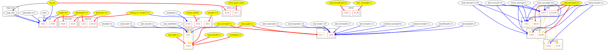

# cargo-depsgraph

This is a tool for rendering dependency graphs from Cargo.lock files, with
a focus on helping figure out why there are multiple versions of a given
crate in the dependency graph.

## Example usage
To generate a dependency graph for, say, 10X Genomics's
[rust-toolbox](https://github.com/10XGenomics/rust-toolbox) workspace,
```bash
$ go get github.com/adam-azarchs/cargo-depsgraph
$ go install github.com/adam-azarchs/cargo-depsgraph
# assuming it was placed in your $PATH,
$ cargo-depsgraph -trim -dot \
    -baseurl https://github.com/10XGenomics/rust-toolbox/blob/master/ \
    Cargo.lock | dot -Tsvg -o tenx_rust_toolbox.svg
```

This renders as



Note that while GitHub does not render href links in SVG, the nodes in
the graph each link to the appropriate page on
[crates.io](https://crates.io) or the location of the git repository, to
simplify for example figuring out if there is a newer version of a crate
which will allow dependencies to be shared better.

For a summary report basically just listing the highlighted nodes which
bring in extra versions of dependencies,
```bash
$ cargo-depsgraph Cargo.lock
bio @ 0.29.0 brings in bytecount @ 0.6.0
bio @ 0.29.0 brings in itertools @ 0.8.2
cargo_metadata @ 0.6.4 brings in semver @ 0.9.0
debruijn @ 0.3.0 brings in itertools @ 0.9.0
debruijn @ 0.3.0 brings in smallvec @ 1.2.0
mirror_sparse_matrix @ 0.1.0 brings in pretty_trace @ 0.1.7
parking_lot_core @ 0.2.14 brings in rand @ 0.4.6
parking_lot_core @ 0.2.14 brings in smallvec @ 0.6.13
rand_chacha @ 0.1.1 brings in autocfg @ 0.1.7
rand_chacha @ 0.1.1 brings in rand_core @ 0.3.1
rand_jitter @ 0.1.4 brings in rand_core @ 0.4.2
rand_os @ 0.1.3 brings in rand_core @ 0.4.2
rand_pcg @ 0.1.2 brings in autocfg @ 0.1.7
rand_pcg @ 0.1.2 brings in rand_core @ 0.4.2
rustc_version @ 0.1.7 brings in semver @ 0.1.20
skeptic @ 0.13.4 brings in bytecount @ 0.4.0
snafu-derive @ 0.5.0 brings in proc-macro2 @ 0.4.30
snafu-derive @ 0.5.0 brings in quote @ 0.6.13
snafu-derive @ 0.5.0 brings in syn @ 0.15.44
statrs @ 0.11.0 brings in rand @ 0.6.5
stirling_numbers @ 0.1.1 brings in rand @ 0.5.6
vdj_ann @ 0.1.0 brings in itertools @ 0.8.2
vdj_ann @ 0.1.0 brings in pretty_trace @ 0.3.0
wyhash @ 0.3.0 brings in rand_core @ 0.4.2
```
These listed packages are good places to start looking at, to figure out
what updates would be most helpful for reducing dependency bloat.

### Color key
Terminology:
* Multi-version crate: a crate for which multiple versions of the same
  crate exist in the dependency graph.
* Majority/minority version: For a multi-version crate, the version with
  the greatest/not-greatest number of other crates depending on it.

#### Nodes
* Red: Nodes for multi-version crates, unless they are in the transitive
  dependencies of another multi-version crate.
* Orange: Nodes for multi-version crates which are in the transitive
  dependencies of another multi-version crate.
* Yellow border: Crates for which there is only one version, but which
  are only depended on by a minority version of a multi-version crate.
* Filled yellow: crates which have a single version and are not in the
  transitive dependencies for a multi-version crate, but which depend on
  a minority version of a multi-version crate.  These are usually the
  ones you should be focusing on trying to update if you want to merge
  your dependencies.
* Black: everything else.

#### Edges
* Orange: Edges from a crate that is in the transitive dependencies of a
  multi-version crate to another multi-version crate.
* Red: Edges from a single-version crate to a multi-version crate that is
  not at the majority version, if the starting node is not in the transitive
  dependencies of a multi-version crate.
* Blue: Edges from a single-version crate to the majority version of a
  multi-version crate, or from a multi-version crate to a single-version
  crate.
* Black: everything else.

### Why did you write a tool for working with rust code in Go?

Because it's faster to develop in and, while I spend lots of time
working _around_ rust code, I don't actually spend much time _writing_
rust code.


